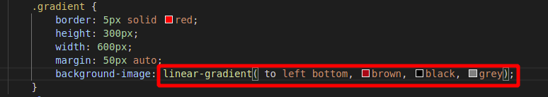
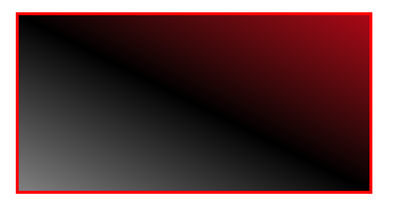
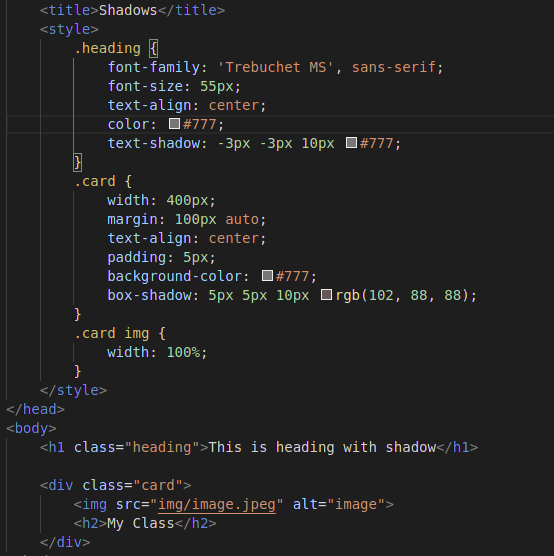
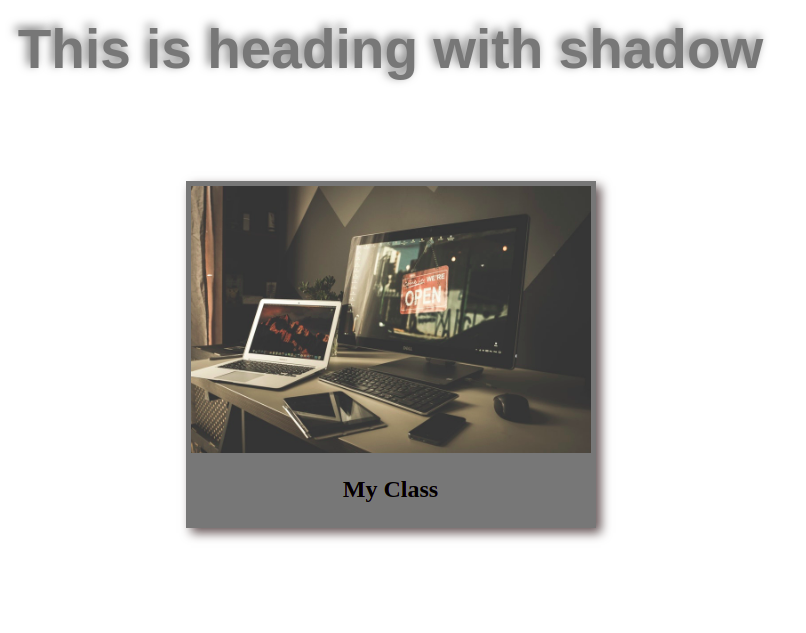

# Advanced CSS

## Backgrounds

## Gradients

The following attributes can be set to achive the below:

Gradients are also used with images. We can set the following attributes:

To achieve this:

## Shadows

We can use the shadow attributes:

to get:

