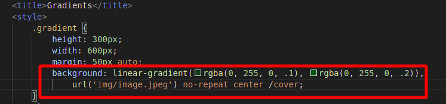

# Advanced CSS

## Backgrounds

## Gradients

The following attributes can be set to achive the below:

Gradients are also used with images. We can set the following attributes:

To achieve this:

## Shadows

We can use the shadow attributes:

to get:

## Transitions

- (req) transition-property: defines the property you want to add effect to
- (req) transition-duration: defines how long you want the transition to continue
- (optional) transition-delay: delay time of effect
- (optional) transition-timing-function: different speeds of effects while effect happens

For setting `transition-timing-function: cubic-bezier` use reference: https://cubic-bezier.com/

shorthand notation for the transition property is: `transition: width 1s 1s ease-in`

for setting multiple transitions: `transition: width 1s 1s ease-in, background-color 5s;`

## Transforms

The transform CSS property lets you rotate, scale, skew, or translate an element. It modifies the coordinate space of the CSS visual formatting model.

We can set the transform attributes to animate objects:

See [demo](https://developer.mozilla.org/en-US/docs/Web/CSS/transform)

## Animations

Keyframes and properties

- (req) animation-name: the keyframe name
- (req) animation-duration:
- (optional) animation-delay: 
- (optional) animation-iteration-count: for looping animations
- (optional) animation-direction: allows animation in a specified direction [normal, reverse, alternate, alternate-reverse]
- (optional) animation-timing-function: [ease, linear, ease-in, ease-out] similar to tranform functions
- (optional) animation-fill-mode: related to starting and ending position of element

Short form:

`animation: <keyframe-name> 4s ease-in 2s infinite alternate both`

