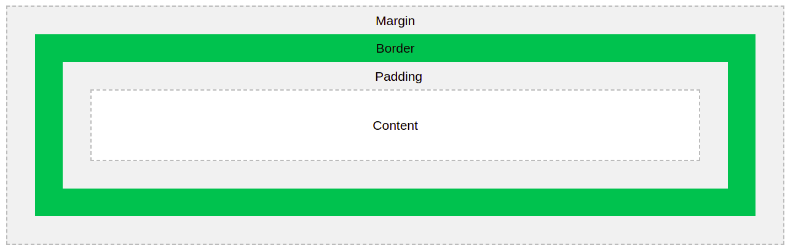

# Introduction + CSS Basics

## Shortcuts

- To create a div element type in `div` and hit tab

- To create 10 div elements type in `div*10` and hit tab

- To create a h1 element with a class tag `heading` type in `h1.heading` to get `<h1 class="heading"></h1>`

- To create a h1 element with a id tag `heading` type in `h1.heading` to get `<h1 id="heading"></h1>`


## Definition

> CSS => style sheet lanaguage to create rules how HTML elements should be displayed

## How to write CSS

Three styling methods:

- inline styling: not the best practice, might lead large and messy code and duplicated code
- internal styling: not the best practice again
- external styling: 


## CSS selectors

style element: best practice to be placed in head element; 
we use selector to apply styles

selecting items preference:
- last in preference 
- id; class; html-tag-names

## CSS combinators

`(space)` descendant combinators

```
    section p {
        ...
    }
```

`>` child combinators

```
    section > p {
        ...
    }
```

`+` adjacent sibling 

```
    section + p {
        ...
    }
```

`~` general sibling 

```
    section ~ p {
        ...
    }
```

## CSS colors

colors can be specified using:
- color names: modern browsers support 140 color names
- rgb values: rgb(red, green, blue); rgba(red, green, blue, opacity) eg. `rgb(255, 0, 0); rgba(255, 0, 0, 0.5)`
- hexadecimal: #ffffff (white); #000000 (black); #ff00000 (red); #00ff00 (green); #00000ff (blue)

## Inheritance

Elements inherit css styling from their parent elements. By default, the closer parent styles take precedence.

## Text formatting

font-size; text-align[left, right, justify, center] (works only with block level element); font-family; font-weight; font-style[italics, normal]

Block element: take up full width that is available on the page
Inline element: take up width that is required to display the content of an element

explored google fonts: https://fonts.google.com/

## Box Model



- border can be specified using: `border: 5px #ff0101 solid;` which translates to `border: border-width border-color border-style`. Each of these values can be independently set as well
- padding can be specified using: `padding: 30px 50px 70px 90px;` which translates to `padding: padding-top padding-right padding-bottom padding-left;`. When we want to set a given value on top & bottom (100px) and another value on left & right (50px) we can do this: `padding: 100px 50px`. And when we want to apply the same value (100px) for all sides, we can do this: `padding: 100px`.
- margin can be specified using: `margin: 30px 50px 70px 90px;` (padding rules apply here too...)

#### Box sizing

Let us set:
- width === 300px 
- height === 300px

- (default) When the property `box-sizing: content-box;` padding and border are not included within height and width
- When the property `box-sizing: border-box;` padding and border are included within height and width

If we want to center a block level element perfectly we can do so by setting 
1. margin as auto 
2. by setting a value to width

 Eg. `margin: 100px auto` centers the block element in the center on the horizontal axis, but does not do the same on the vertical axis (since 100px is set)

## Pseudo classes

> A CSS pseudo-class is a keyword added to a selector that specifies a special state of the selected element(s). For example, :hover can be used to change a button's color when the user's pointer hovers over it.

```css
/* Any button over which the user's pointer is hovering */
button:hover {
  color: blue;
}
```
Pseudo-classes let you apply a style to an element not only in relation to the content of the document tree, but also in relation to external factors like the history of the navigator (:visited, for example), the status of its content (like :checked on certain form elements), or the position of the mouse (like :hover, which lets you know if the mouse is over an element or not).

## Pseudo elements

**Pseduo classes**: define special state of an element (`a:hover`)
**Pseudo elements**: define style for specific part of an element (`h1::after`)

> A CSS pseudo-element is a keyword added to a selector that lets you style a specific part of the selected element(s). For example, ::first-line can be used to change the font of the first line of a paragraph.

```css
/* The first line of every <p> element. */
p::first-line {
  color: blue;
  text-transform: uppercase;
}
```

## Measurement Units

In general, css supports: Absolute and Relative

- Absolute: are fixed units
    - Pixel(px) (1px === 12.54cm), Centimeter(cm), Millimeter(mm), Inch(in), Points(pt), Pica(pc)
As web devs, we usually use Pixels, other units are not recommend to be used


- Relative units specify length relative t0 another property
    - em, rem, vw, vh, %

In case of relative units, the unit is relative to the value set on the parent element or the root element

While em is relative to the font-size of its direct or nearest parent, rem is only relative to the html (root) font-size.